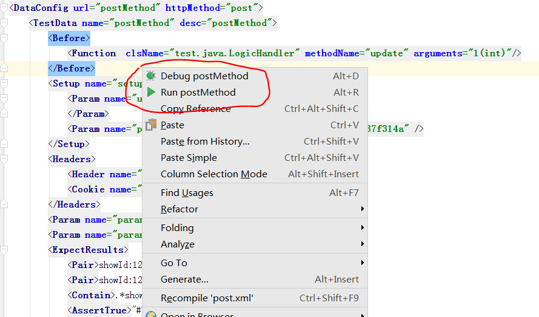
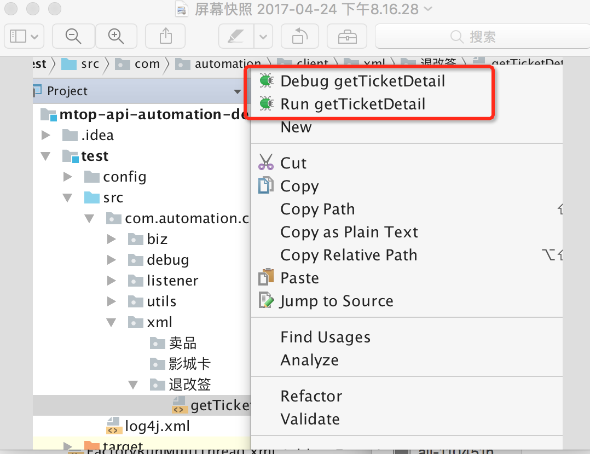
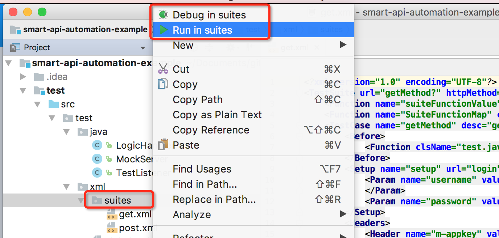

# Aping - a plugin for IDE intellij idea

Support to execute run/debug test from xml directly, which will be more convenient/effectively for automation project based on [smart-api-framework](https://github.com/lwfwind/smart-api-framework)

* Tags: intellij plugin,intellij idea plugin, XML, plugin, Automation

## Features

* Support execute run/debug test case from editor context menu

* Support execute run/debug test suite while selecting the xml from project view context menu

* Support execute all run/debug test suites while selecting the dir from project view context menu

Demo project please refer to  [smart-api-automation-example](https://github.com/lwfwind/smart-api-automation-example)
